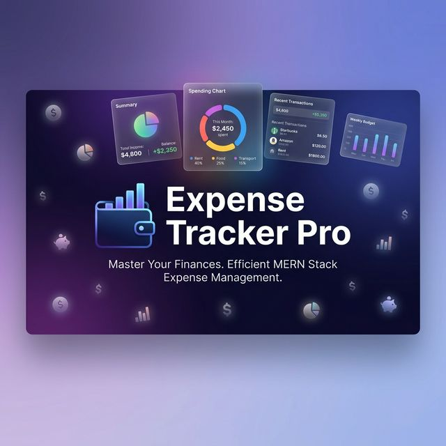
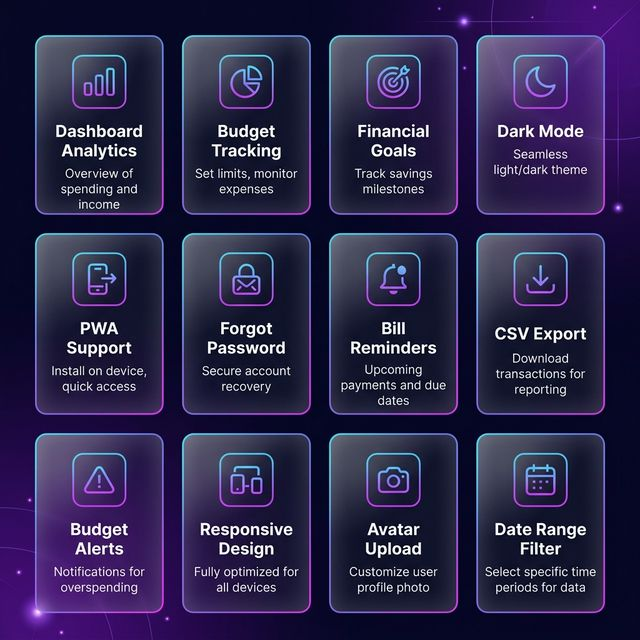

# 💰 Expense Tracker Pro

> A comprehensive full-stack personal finance management application built with the **MERN stack** — track income, expenses, budgets, and savings goals with beautiful charts and real-time alerts.



---

## 📸 Preview


---

## ✨ Features at a Glance



| Category | Features |
|----------|----------|
| **Core Finance** | Income & Expense CRUD, Category management, Transaction history |
| **Budgeting** | Monthly budget limits per category, Progress bars, 80%/100% alerts |
| **Goals** | Savings targets with contributions, Animated progress, Deadlines |
| **Dashboard** | KPI cards, Line/Doughnut/Bar charts, Date range filter, Bill reminders |
| **Auth & Security** | JWT login/register, Forgot password/reset flow, Protected routes |
| **Profile** | Avatar upload, Currency selection, Account management |
| **UX Polish** | Dark mode, Loading skeletons, Delete confirmations, Error boundary, 404 page |
| **Mobile & PWA** | Responsive hamburger nav, All grids adapt, Installable PWA with offline caching |
| **Data** | CSV export, Search & filter, Inline edit modal, Recurring transactions |

---

## 🏗️ System Architecture


```
┌─────────────────────────────────────────────────────────────┐
│                     FRONTEND (React.js)                     │
│  ┌─────────┐ ┌──────────┐ ┌─────────┐ ┌────────┐          │
│  │Dashboard│ │Incomes/  │ │ Budgets │ │ Goals  │          │
│  │  KPIs   │ │Expenses  │ │ Alerts  │ │Progress│          │
│  │  Charts │ │  CRUD    │ │Progress │ │ Track  │          │
│  └─────────┘ └──────────┘ └─────────┘ └────────┘          │
│  ┌─────────┐ ┌──────────┐ ┌─────────────────────┐         │
│  │Settings │ │   Auth   │ │  Navigation (Resp.) │         │
│  │ Profile │ │Login/Reg │ │  Hamburger Menu     │         │
│  │DarkMode │ │ForgotPwd │ │  Avatar Display     │         │
│  └─────────┘ └──────────┘ └─────────────────────┘         │
│                    Context API (State)                      │
│                    PWA Service Worker                       │
└──────────────────────────┬──────────────────────────────────┘
                           │ Axios HTTP (REST)
                           ▼
┌─────────────────────────────────────────────────────────────┐
│                  BACKEND (Node.js + Express)                │
│  ┌─────────────────────────────────────────────────┐       │
│  │ Middleware: JWT Auth │ Multer (Avatar Upload)    │       │
│  └─────────────────────────────────────────────────┘       │
│  ┌──────┐ ┌────────┐ ┌──────┐ ┌──────┐ ┌────────┐        │
│  │ Auth │ │ Income │ │Expns │ │Budget│ │  Goal  │        │
│  │Ctrl  │ │ Ctrl   │ │ Ctrl │ │ Ctrl │ │  Ctrl  │        │
│  └──────┘ └────────┘ └──────┘ └──────┘ └────────┘        │
│                    Mongoose ODM                             │
└──────────────────────────┬──────────────────────────────────┘
                           │
                           ▼
              ┌─────────────────────────┐
              │   MongoDB Atlas         │
              │  ┌─────┐ ┌──────────┐  │
              │  │Users│ │Incomes   │  │
              │  └─────┘ │Expenses  │  │
              │  ┌──────┐│Budgets   │  │
              │  │Goals ││          │  │
              │  └──────┘└──────────┘  │
              └─────────────────────────┘
```

---

## 📂 Project Structure

```
expense-tracker/
├── Frontend/                          # React.js SPA
│   ├── public/
│   │   ├── manifest.json              # PWA manifest
│   │   ├── service-worker.js          # Offline caching service worker
│   │   ├── banner.png                 # Project banner image
│   │   ├── architecture.png           # Architecture diagram
│   │   ├── features.png              # Features showcase
│   │   ├── 4.png                      # App screenshot
│   │   ├── logo192.png / logo512.png  # PWA icons
│   │   └── index.html                 # Entry HTML
│   └── src/
│       ├── Components/
│       │   ├── Auth/                  # Login, Register, ForgotPassword, ResetPassword
│       │   ├── Dashboard/             # KPI cards, Charts, Budget alerts, Bill reminders
│       │   ├── Incomes/               # Income CRUD + search/filter/edit
│       │   ├── Expenses/              # Expense CRUD + search/filter/edit
│       │   ├── Budgets/               # Budget form + progress bars + alerts
│       │   ├── Goals/                 # Goal creation, progress, contributions
│       │   ├── Settings/              # Profile, avatar, currency, dark mode, export
│       │   ├── Navigation/            # Responsive sidebar + hamburger menu
│       │   ├── Chart/                 # Line, Doughnut, Bar chart components
│       │   ├── History/               # Recent transaction list
│       │   ├── IncomeItem/            # Reusable transaction card
│       │   ├── Form/                  # Income/Expense form
│       │   ├── Button/                # Reusable button component
│       │   ├── Orb/                   # Animated background gradient orb
│       │   ├── Skeleton/              # Loading shimmer placeholders
│       │   ├── ConfirmModal/          # Delete confirmation dialog
│       │   ├── ErrorBoundary/         # Runtime crash handler
│       │   └── NotFound/              # 404 page
│       ├── Context/
│       │   ├── authContext.js         # Auth state + JWT management
│       │   ├── globalContext.js       # Financial data state + API calls
│       │   └── ThemeContext.js        # Dark/light mode toggle
│       ├── Styles/
│       │   ├── GloabalStyle.js        # CSS variables + theme tokens
│       │   └── layout.js             # Layout utilities
│       ├── Utils/
│       │   ├── icons.js               # FontAwesome icon components
│       │   ├── dateFormat.js          # Date formatting utility
│       │   └── menuItems.js           # Navigation menu config
│       ├── img/                       # Background images
│       ├── App.js                     # Routes + protected layout
│       └── index.js                   # Entry + ErrorBoundary + SW registration
│
├── Backend/                           # Express.js REST API
│   ├── controllers/
│   │   ├── auth.js                    # Register, Login, Profile, Avatar, Password Reset
│   │   ├── income.js                  # Income CRUD operations
│   │   ├── expense.js                 # Expense CRUD operations
│   │   ├── budget.js                  # Budget CRUD operations
│   │   ├── goal.js                    # Goal CRUD operations
│   │   └── export.js                  # CSV data export
│   ├── middleware/
│   │   ├── authMiddleware.js          # JWT token verification
│   │   └── upload.js                  # Multer file upload config
│   ├── models/
│   │   ├── userModel.js               # User schema + bcrypt hooks
│   │   ├── incomeModel.js             # Income schema
│   │   ├── expenseModel.js            # Expense schema
│   │   ├── budgetModel.js             # Budget schema + compound index
│   │   └── goalModel.js               # Goal schema
│   ├── db/
│   │   └── db.js                      # MongoDB connection
│   ├── routes/
│   │   └── transactions.js            # All API route definitions
│   ├── uploads/                       # Avatar file storage
│   ├── app.js                         # Express app setup
│   └── package.json                   # Dependencies
│
├── SRS.md                             # Software Requirements Specification
├── README.md                          # This file
├── LICENSE                            # MIT License
└── .gitignore
```

---

## 🔄 Application Workflow

### User Journey
```
┌──────────┐     ┌──────────┐     ┌──────────────┐
│ Register │ ──► │  Login   │ ──► │  Dashboard   │
└──────────┘     └──────────┘     └──────┬───────┘
                      │                   │
               ┌──────┴──────┐    ┌──────┴───────┐
               │   Forgot    │    │   Navigate   │
               │  Password   │    │   Sidebar    │
               └──────┬──────┘    └──────┬───────┘
               ┌──────┴──────┐           │
               │   Reset     │    ┌──────┴───────────────────────┐
               │  Password   │    │                              │
               └─────────────┘    ▼                              ▼
                          ┌──────────────┐            ┌──────────────┐
                          │   Incomes    │            │   Expenses   │
                          │  Add/Edit/   │            │  Add/Edit/   │
                          │  Delete/     │            │  Delete/     │
                          │  Search      │            │  Search      │
                          └──────────────┘            └──────────────┘
                                  │                          │
                          ┌──────────────┐            ┌──────────────┐
                          │   Budgets    │            │    Goals     │
                          │  Set Limits  │◄──Alerts──►│  Save Money  │
                          │  Track %     │            │  Contribute  │
                          └──────────────┘            └──────────────┘
                                  │
                          ┌──────────────┐
                          │   Settings   │
                          │  Profile     │
                          │  Dark Mode   │
                          │  Export CSV  │
                          └──────────────┘
```

### Dashboard Data Flow
```
1. User lands on Dashboard
2. useEffect fetches: getIncomes(), getExpenses(), getBudgets()
3. While loading → DashboardSkeleton (shimmer)
4. Data arrives → KPI cards calculate totals
5. Charts render (Line, Doughnut, Bar)
6. Budget alerts check 80%/100% thresholds → show banners
7. Bill reminders filter recurring expenses due within 7 days
8. Date range filter recalculates all metrics dynamically
```

---

## 🛠️ Tech Stack

| Layer | Technology | Purpose |
|-------|-----------|---------|
| **Frontend** | React.js 18 | Component-based UI |
| | Styled Components | CSS-in-JS theming |
| | Chart.js + react-chartjs-2 | Data visualization |
| | Axios | HTTP client |
| | React Toastify | Toast notifications |
| | React Router v6 | Client-side routing |
| | FontAwesome | Icon library |
| | Moment.js | Date formatting |
| **Backend** | Node.js | Runtime environment |
| | Express.js | REST API framework |
| | Mongoose | MongoDB ODM |
| | JWT (jsonwebtoken) | Stateless authentication |
| | Bcrypt.js | Password hashing |
| | Multer | File upload (avatars) |
| | CORS | Cross-origin requests |
| | Dotenv | Environment variables |
| **Database** | MongoDB Atlas | Cloud NoSQL database |
| **PWA** | Service Worker | Offline caching |
| | manifest.json | Install prompt |

---

## 🚀 Installation & Setup

### Prerequisites
- **Node.js** v14 or higher
- **MongoDB** database (local or [MongoDB Atlas](https://www.mongodb.com/atlas))
- **Git** for cloning

### 1. Clone the Repository
```bash
git clone https://github.com/yourusername/expense-tracker.git
cd expense-tracker
```

### 2. Backend Setup
```bash
cd Backend
npm install
```

Create a `.env` file:
```env
PORT=5000
MONGO_URL=mongodb+srv://your_connection_string
JWT_SECRET=your_super_secret_jwt_key
```

Start the server:
```bash
npm start
# Server runs on http://localhost:5000
```

### 3. Frontend Setup
```bash
cd Frontend
npm install
npm start
# App opens at http://localhost:3000
```

### 4. PWA Installation
After opening the app in Chrome:
1. Click the **install icon** (⊕) in the address bar
2. Click **Install** in the prompt
3. The app is now available as a native-like application on your device

---

## 📡 API Endpoints

### Authentication
| Method | Endpoint | Description |
|--------|---------|-------------|
| `POST` | `/api/v1/auth/register` | Register new user |
| `POST` | `/api/v1/auth/login` | Login → returns JWT |
| `GET` | `/api/v1/auth/profile` | Get user profile 🔒 |
| `PUT` | `/api/v1/auth/profile` | Update profile 🔒 |
| `POST` | `/api/v1/auth/avatar` | Upload avatar 🔒 |
| `POST` | `/api/v1/auth/forgot-password` | Request reset token |
| `PUT` | `/api/v1/auth/reset-password/:token` | Reset password |

### Income
| Method | Endpoint | Description |
|--------|---------|-------------|
| `POST` | `/api/v1/add-income` | Add income 🔒 |
| `GET` | `/api/v1/get-incomes` | Get all incomes 🔒 |
| `PUT` | `/api/v1/update-income/:id` | Update income 🔒 |
| `DELETE` | `/api/v1/delete-income/:id` | Delete income 🔒 |

### Expense
| Method | Endpoint | Description |
|--------|---------|-------------|
| `POST` | `/api/v1/add-expense` | Add expense 🔒 |
| `GET` | `/api/v1/get-expenses` | Get all expenses 🔒 |
| `PUT` | `/api/v1/update-expense/:id` | Update expense 🔒 |
| `DELETE` | `/api/v1/delete-expense/:id` | Delete expense 🔒 |

### Budget
| Method | Endpoint | Description |
|--------|---------|-------------|
| `POST` | `/api/v1/add-budget` | Add/update budget 🔒 |
| `GET` | `/api/v1/get-budgets` | Get budgets (month, year) 🔒 |
| `DELETE` | `/api/v1/delete-budget/:id` | Delete budget 🔒 |

### Goal
| Method | Endpoint | Description |
|--------|---------|-------------|
| `POST` | `/api/v1/add-goal` | Create goal 🔒 |
| `GET` | `/api/v1/get-goals` | Get all goals 🔒 |
| `PUT` | `/api/v1/update-goal/:id` | Update/contribute 🔒 |
| `DELETE` | `/api/v1/delete-goal/:id` | Delete goal 🔒 |

### Export
| Method | Endpoint | Description |
|--------|---------|-------------|
| `GET` | `/api/v1/export/csv` | Export all data as CSV 🔒 |

> 🔒 = Requires JWT Authorization header

---

## 📊 Data Models

```
┌─────────────┐     ┌─────────────┐     ┌─────────────┐
│    User      │     │   Income    │     │   Expense   │
├─────────────┤     ├─────────────┤     ├─────────────┤
│ name        │◄────│ user (ref)  │     │ user (ref)  │────►│
│ email       │     │ title       │     │ title       │
│ password    │     │ amount      │     │ amount      │
│ currency    │     │ date        │     │ date        │
│ avatar      │     │ category    │     │ category    │
│ resetToken  │     │ description │     │ description │
│ resetExpiry │     │ isRecurring │     │ isRecurring │
└─────────────┘     │ recInterval │     │ recInterval │
       │            └─────────────┘     └─────────────┘
       │
       │            ┌─────────────┐     ┌─────────────┐
       │            │   Budget    │     │    Goal     │
       │            ├─────────────┤     ├─────────────┤
       └───────────►│ user (ref)  │     │ user (ref)  │◄────┘
                    │ category    │     │ title       │
                    │ amount      │     │ targetAmt   │
                    │ month       │     │ currentAmt  │
                    │ year        │     │ deadline    │
                    │ [unique idx]│     │ icon        │
                    └─────────────┘     └─────────────┘
```

---

## ✅ Implemented Features Checklist

- ✅ User authentication (JWT login/register)
- ✅ Forgot password / reset flow (token-based)
- ✅ Income & expense CRUD with categories
- ✅ Recurring transactions (daily/weekly/monthly/yearly)
- ✅ Search & filter transactions
- ✅ Inline edit modal
- ✅ Budget planning with progress bars
- ✅ Budget alerts (80% warning + 100% danger toasts & banners)
- ✅ Financial goals with animated progress
- ✅ Dashboard with KPI cards + 3 chart types
- ✅ Dashboard date range filter
- ✅ Bill reminders for upcoming recurring expenses
- ✅ Profile avatar upload (Multer)
- ✅ Multiple currency support
- ✅ Dark mode with persistent preference
- ✅ CSV data export
- ✅ Responsive mobile navigation (hamburger menu)
- ✅ Responsive layouts on all 6 pages
- ✅ PWA support (installable + offline caching)
- ✅ Loading skeletons (shimmer placeholders)
- ✅ Delete confirmation modals
- ✅ 404 page
- ✅ Error boundary (crash handler)

---

## 📝 Documentation

- **[SRS.md](./SRS.md)** — Full Software Requirements Specification
- **[LICENSE](./LICENSE)** — MIT License

---

## 🤝 Contributing

1. Fork the repository
2. Create your feature branch: `git checkout -b feature/amazing-feature`
3. Commit your changes: `git commit -m 'Add some amazing feature'`
4. Push to the branch: `git push origin feature/amazing-feature`
5. Open a Pull Request

---

## 📄 License

This project is licensed under the [MIT License](LICENSE).

---

<p align="center">
  Built with ❤️ using the MERN Stack
</p>