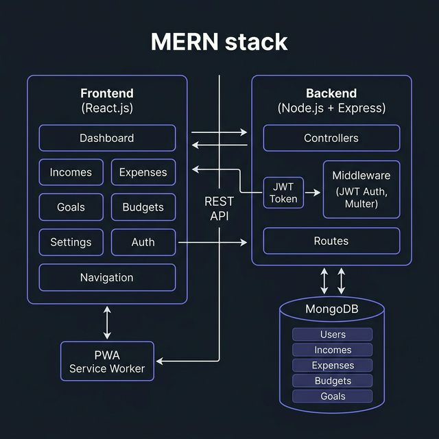

# Software Requirements Specification (SRS)
## Expense Tracker Pro — MERN Stack Application

**Version:** 2.0  
**Date:** March 2026  
**Author:** Koooowal  

---

## 1. Introduction

### 1.1 Purpose
This SRS defines the functional and non-functional requirements for **Expense Tracker Pro**, a full-stack personal finance management application built on the MERN stack (MongoDB, Express.js, React.js, Node.js). It serves as a technical reference for development, testing, and portfolio demonstration.

### 1.2 Scope
The system enables authenticated users to:
- Track income and expense transactions with categories and recurring intervals
- Set monthly budget limits and receive real-time alerts at 80% and 100% thresholds
- Create and contribute to financial savings goals with deadline tracking
- Visualize financial data through interactive charts (line, doughnut, bar)
- Manage their profile, avatar, currency, and theme preferences
- Reset forgotten passwords via token-based recovery
- Install the app as a PWA for offline access

### 1.3 Definitions & Acronyms
| Term | Definition |
|------|-----------|
| MERN | MongoDB, Express.js, React.js, Node.js |
| JWT | JSON Web Token — stateless authentication |
| PWA | Progressive Web App — installable with offline support |
| KPI | Key Performance Indicator — dashboard metric cards |
| CRUD | Create, Read, Update, Delete operations |
| SPA | Single Page Application |

---

## 2. Overall Description

### 2.1 Product Perspective
Expense Tracker Pro is a standalone web application with a React SPA frontend communicating with a RESTful Node.js/Express backend, persisting data in MongoDB Atlas.

### 2.2 User Classes
| User Class | Description |
|-----------|-------------|
| **Guest** | Can access Login, Register, Forgot Password, and Reset Password pages |
| **Authenticated User** | Full access to dashboard, transactions, budgets, goals, and settings |

### 2.3 Operating Environment
- **Client:** Modern browsers (Chrome 80+, Firefox 75+, Safari 13+, Edge 80+), mobile browsers
- **Server:** Node.js v14+, MongoDB 4.4+
- **Deployment:** Any cloud provider (Heroku, Render, Vercel, AWS)

### 2.4 Design Constraints
- Single-tenant: Each user sees only their own data
- Stateless auth via JWT stored in localStorage
- No server-side rendering — fully client-rendered SPA
- PWA service worker uses cache-first for assets, network-first for API

---

## 3. System Architecture



### 3.1 Frontend Architecture
```
React.js SPA
├── Context API (AuthContext, GlobalContext, ThemeContext)
├── 18 Component Modules
│   ├── Auth (Login, Register, ForgotPassword, ResetPassword)
│   ├── Dashboard (KPIs, Charts, Budget Alerts, Bill Reminders)
│   ├── Incomes / Expenses (CRUD, Search, Filter, Edit Modal)
│   ├── Budgets (Monthly limits, Progress bars, Alerts)
│   ├── Goals (Savings targets, Contributions, Deadlines)
│   ├── Settings (Profile, Avatar, Currency, Dark Mode, Export)
│   ├── Navigation (Hamburger menu, Avatar, Responsive)
│   ├── Skeleton (Loading shimmer placeholders)
│   ├── ConfirmModal (Delete confirmation dialogs)
│   ├── ErrorBoundary (Runtime crash handler)
│   └── NotFound (404 page)
├── Styled Components (CSS-in-JS)
├── Chart.js (Line, Doughnut, Bar)
└── PWA Service Worker (Offline caching)
```

### 3.2 Backend Architecture
```
Express.js REST API
├── Routes → Controllers → Models
├── Middleware
│   ├── authMiddleware.js (JWT verification)
│   └── upload.js (Multer — avatar file upload)
├── Controllers
│   ├── auth.js (Register, Login, Profile, Avatar, Password Reset)
│   ├── income.js (Add, Get, Update, Delete)
│   ├── expense.js (Add, Get, Update, Delete)
│   ├── budget.js (Add/Update, Get, Delete)
│   ├── goal.js (Add, Get, Update, Delete)
│   └── export.js (CSV export)
└── MongoDB (Mongoose ODM)
```

### 3.3 Data Flow
```
User Browser ──► React SPA ──► Axios HTTP ──► Express Routes
                                                    │
                                              JWT Middleware
                                                    │
                                              Controllers
                                                    │
                                              Mongoose Models
                                                    │
                                              MongoDB Atlas
```

---

## 4. Data Models

### 4.1 User
| Field | Type | Constraints |
|-------|------|------------|
| name | String | Required, max 50 chars |
| email | String | Required, unique, valid email format |
| password | String | Required, min 6 chars, bcrypt hashed, `select: false` |
| currency | String | Default: `$` |
| avatar | String | File path to uploaded image |
| resetPasswordToken | String | Crypto-generated hex token |
| resetPasswordExpires | Date | Token expiry timestamp |
| timestamps | Auto | `createdAt`, `updatedAt` |

### 4.2 Income
| Field | Type | Constraints |
|-------|------|------------|
| title | String | Required, max 50 chars |
| amount | Number | Required |
| type | String | Default: `income` |
| date | Date | Required |
| category | String | Required, max 20 chars |
| description | String | Required, max 20 chars |
| isRecurring | Boolean | Default: `false` |
| recurringInterval | String | Enum: `daily`, `weekly`, `monthly`, `yearly` |
| user | ObjectId | Reference to User |

### 4.3 Expense
Same schema as Income with `type` default: `expense`.

### 4.4 Budget
| Field | Type | Constraints |
|-------|------|------------|
| user | ObjectId | Reference to User |
| category | String | Required, max 30 chars |
| amount | Number | Required, min 0 |
| month | Number | Required, 1–12 |
| year | Number | Required |
| **Compound Index** | | `user + category + month + year` (unique) |

### 4.5 Goal
| Field | Type | Constraints |
|-------|------|------------|
| title | String | Required, max 50 chars |
| targetAmount | Number | Required, min 1 |
| currentAmount | Number | Default: 0, min 0 |
| deadline | Date | Optional |
| icon | String | Default: `🎯` |
| user | ObjectId | Reference to User |

---

## 5. Functional Requirements

### 5.1 Authentication (FR-AUTH)
| ID | Requirement | Priority |
|----|------------|----------|
| FR-AUTH-01 | Users can register with name, email, password | High |
| FR-AUTH-02 | Users can login with email and password | High |
| FR-AUTH-03 | JWT token issued on login, stored in localStorage | High |
| FR-AUTH-04 | Protected routes require valid JWT | High |
| FR-AUTH-05 | Users can request password reset via email | Medium |
| FR-AUTH-06 | Reset token expires after a defined period | Medium |
| FR-AUTH-07 | Users can upload profile avatar via Multer | Low |

### 5.2 Income Management (FR-INC)
| ID | Requirement | Priority |
|----|------------|----------|
| FR-INC-01 | Users can add income with title, amount, date, category, description | High |
| FR-INC-02 | Users can view all their income entries | High |
| FR-INC-03 | Users can edit existing income entries via modal | Medium |
| FR-INC-04 | Users can delete income with confirmation dialog | High |
| FR-INC-05 | Users can search incomes by title/description | Medium |
| FR-INC-06 | Users can filter incomes by category | Medium |
| FR-INC-07 | Users can mark income as recurring with interval | Medium |

### 5.3 Expense Management (FR-EXP)
Same as FR-INC-01 through FR-INC-07 for expenses.

### 5.4 Budget Management (FR-BUD)
| ID | Requirement | Priority |
|----|------------|----------|
| FR-BUD-01 | Users can set a monthly budget limit per expense category | High |
| FR-BUD-02 | Progress bars show spending vs. budget limit | High |
| FR-BUD-03 | Toast alerts fire at 80% and 100% thresholds | High |
| FR-BUD-04 | Dashboard shows alert banners for over-budget categories | Medium |
| FR-BUD-05 | Users can delete budgets with confirmation | Medium |

### 5.5 Financial Goals (FR-GOAL)
| ID | Requirement | Priority |
|----|------------|----------|
| FR-GOAL-01 | Users can create a savings goal with title, target amount, icon, deadline | High |
| FR-GOAL-02 | Users can contribute amounts toward a goal | High |
| FR-GOAL-03 | Animated progress bars show goal completion percentage | Medium |
| FR-GOAL-04 | Summary cards show total goals, completed, in-progress, total saved | Medium |
| FR-GOAL-05 | Users can delete goals with confirmation | Medium |

### 5.6 Dashboard (FR-DASH)
| ID | Requirement | Priority |
|----|------------|----------|
| FR-DASH-01 | Display KPI cards: Total Income, Total Expenses, Net Balance, Quick Stats | High |
| FR-DASH-02 | Income vs Expense line chart | High |
| FR-DASH-03 | Spending category doughnut chart | High |
| FR-DASH-04 | Monthly overview bar chart | Medium |
| FR-DASH-05 | Date range filter: All Time, This Month, Last 3 Months, This Year | Medium |
| FR-DASH-06 | Upcoming bill reminders for recurring expenses (next 7 days) | Medium |
| FR-DASH-07 | Budget alert banners at top of dashboard | Medium |
| FR-DASH-08 | Loading skeleton shown during initial data fetch | Low |

### 5.7 Settings (FR-SET)
| ID | Requirement | Priority |
|----|------------|----------|
| FR-SET-01 | Users can update profile (name, email) | Medium |
| FR-SET-02 | Users can change currency symbol | Medium |
| FR-SET-03 | Users can toggle dark mode with persistent preference | Medium |
| FR-SET-04 | Users can export all data as CSV | Medium |
| FR-SET-05 | Users can delete their account | Low |

### 5.8 Navigation & UX (FR-NAV)
| ID | Requirement | Priority |
|----|------------|----------|
| FR-NAV-01 | Sidebar navigation with 7 sections + avatar display | High |
| FR-NAV-02 | Hamburger menu on mobile (<768px) | High |
| FR-NAV-03 | 404 page for unmatched routes | Low |
| FR-NAV-04 | Error boundary prevents white-screen crashes | Low |
| FR-NAV-05 | Delete confirmation modal for all destructive actions | Medium |

---

## 6. API Specification

### 6.1 Authentication Endpoints
| Method | Endpoint | Description | Auth |
|--------|---------|-------------|------|
| POST | `/api/v1/auth/register` | Register new user | No |
| POST | `/api/v1/auth/login` | Login, returns JWT | No |
| GET | `/api/v1/auth/profile` | Get profile | Yes |
| PUT | `/api/v1/auth/profile` | Update profile | Yes |
| POST | `/api/v1/auth/avatar` | Upload avatar (multipart) | Yes |
| POST | `/api/v1/auth/forgot-password` | Request reset token | No |
| PUT | `/api/v1/auth/reset-password/:token` | Reset password | No |

### 6.2 Income Endpoints
| Method | Endpoint | Description | Auth |
|--------|---------|-------------|------|
| POST | `/api/v1/add-income` | Add income | Yes |
| GET | `/api/v1/get-incomes` | Get all incomes | Yes |
| PUT | `/api/v1/update-income/:id` | Update income | Yes |
| DELETE | `/api/v1/delete-income/:id` | Delete income | Yes |

### 6.3 Expense Endpoints
| Method | Endpoint | Description | Auth |
|--------|---------|-------------|------|
| POST | `/api/v1/add-expense` | Add expense | Yes |
| GET | `/api/v1/get-expenses` | Get all expenses | Yes |
| PUT | `/api/v1/update-expense/:id` | Update expense | Yes |
| DELETE | `/api/v1/delete-expense/:id` | Delete expense | Yes |

### 6.4 Budget Endpoints
| Method | Endpoint | Description | Auth |
|--------|---------|-------------|------|
| POST | `/api/v1/add-budget` | Add/update budget | Yes |
| GET | `/api/v1/get-budgets` | Get budgets (query: month, year) | Yes |
| DELETE | `/api/v1/delete-budget/:id` | Delete budget | Yes |

### 6.5 Goal Endpoints
| Method | Endpoint | Description | Auth |
|--------|---------|-------------|------|
| POST | `/api/v1/add-goal` | Create goal | Yes |
| GET | `/api/v1/get-goals` | Get all goals | Yes |
| PUT | `/api/v1/update-goal/:id` | Update / contribute | Yes |
| DELETE | `/api/v1/delete-goal/:id` | Delete goal | Yes |

### 6.6 Export Endpoints
| Method | Endpoint | Description | Auth |
|--------|---------|-------------|------|
| GET | `/api/v1/export/csv` | Export data as CSV | Yes |

---

## 7. Non-Functional Requirements

| ID | Requirement | Category |
|----|------------|----------|
| NFR-01 | Pages load within 2 seconds on 3G network | Performance |
| NFR-02 | Passwords hashed with bcrypt (10 salt rounds) | Security |
| NFR-03 | JWT tokens used for stateless authentication | Security |
| NFR-04 | App installable as PWA with offline asset caching | Availability |
| NFR-05 | Responsive layout works on screens 320px–1920px+ | Usability |
| NFR-06 | Dark mode persists across sessions via localStorage | Usability |
| NFR-07 | Error boundary prevents white-screen crashes | Reliability |
| NFR-08 | Loading skeletons provide visual feedback during data fetch | Usability |
| NFR-09 | Confirmation dialogs prevent accidental data deletion | Safety |
| NFR-10 | All CRUD operations scoped to authenticated user only | Security |

---

## 8. User Interface Requirements

### 8.1 Pages
| Page | Description |
|------|------------|
| Login | Email + password form, forgot password link, register link |
| Register | Name, email, password form |
| Forgot Password | Email input, sends reset token |
| Reset Password | New password form (accessed via token URL) |
| Dashboard | KPI cards, 3 chart types, budget alerts, bill reminders |
| Incomes | Income form + list with search, filter, edit, delete |
| Expenses | Expense form + list with search, filter, edit, delete |
| Budgets | Budget form + progress bar cards per category |
| Goals | Goal creation + animated progress + contribution |
| Settings | Profile edit, avatar, currency, dark mode, export, delete account |
| 404 | Styled "Page Not Found" with navigation buttons |

### 8.2 Responsive Breakpoints
| Breakpoint | Layout Changes |
|-----------|----------------|
| > 768px | Full sidebar, multi-column grids |
| ≤ 768px | Hamburger nav, single-column grids, stacked forms |
| ≤ 480px | KPI cards single column, reduced font sizes |

---

## 9. Technology Stack

| Layer | Technology |
|-------|-----------|
| Frontend | React.js 18, Styled Components, Chart.js, Axios, React Toastify |
| Backend | Node.js, Express.js, Mongoose ODM, JWT, Bcrypt.js, Multer |
| Database | MongoDB Atlas |
| PWA | Custom Service Worker, manifest.json |
| Version Control | Git + GitHub |

---

## 10. Assumptions & Dependencies

- MongoDB Atlas is accessible from the deployment environment
- Users have modern browsers with JavaScript enabled
- File uploads (avatars) are stored on the server filesystem
- No email service is integrated — reset tokens are returned in API response
- Single-user per session — no collaborative features

---

*End of SRS Document*
